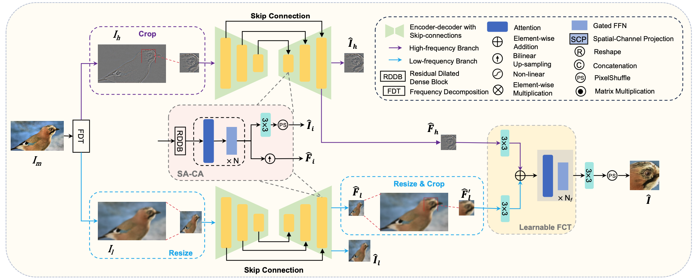
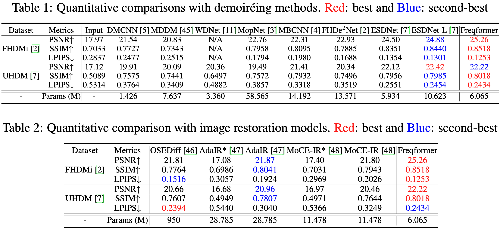

# Freqformer: Image-Demoiréing Transformer via Efficient Frequency Decomposition

[Xiaoyang Liu](https://xyliu339.github.io/), [Bolin Qiu](https://github.com/BolinQiu), [Jiezhang Cao](https://www.jiezhangcao.com/), [Zheng Chen](https://zhengchen1999.github.io/), [Yulun Zhang](http://yulunzhang.com/) and [Xiaokang Yang](https://scholar.google.com/citations?user=yDEavdMAAAAJ), "Freqformer: Image-Demoiréing Transformer via Efficient Frequency Decomposition", arxiv, 2025.

[](https://github.com/xyLiu339/Freqformer/releases) 
[](https://github.com/xyLiu339/Freqformer) 
[](https://github.com/xyLiu339/Freqformer) 

[[arXiv](http://arxiv.org/abs/2505.19120)] [[supplementary material](https://github.com/xyLiu339/Freqformer/releases)]

---

> **Abstract:** Image demoiréing remains a challenging task due to the complex interplay between texture corruption and color distortions caused by moiré patterns. Existing methods, especially those relying on direct image-to-image restoration, often fail to disentangle these intertwined artifacts effectively. While wavelet-based frequency-aware approaches offer a promising direction, their potential remains underexplored. In this paper, we present Freqformer, a Transformer-based framework specifically designed for image demoiréing through targeted frequency separation. Our method performs an effective frequency decomposition that explicitly splits moiré patterns into high-frequency spatially-localized textures and low-frequency scale-robust color distortions, which are then handled by a dual-branch architecture tailored to their distinct characteristics. We further propose a learnable Frequency Composition Transform (FCT) module to adaptively fuse the frequency-specific outputs, enabling consistent and high-fidelity reconstruction. To better aggregate the spatial dependencies and the inter-channel complementary information, we introduce a Spatial-Aware Channel Attention (SA-CA) module that refines moiré-sensitive regions without incurring high computational cost. Extensive experiments on various demoiréing benchmarks demonstrate that Freqformer achieves state-of-the-art performance with a compact model size.

<div align=center>
    
</div>

<div align=center>
    
</div>


---

### 🔖 TODO
* [ ] Release code and pretrained models.

## 🔗 Contents

- [ ] Models
- [ ] Training
- [ ] Testing
- [x] [Results](#results)
- [x] [Citation](#citation)
- [ ] [Acknowledgements](#acknowledgements)


## <a name="results"></a>🔎 Results
<details open>
<summary>Quantitative Results </summary>


<div align=center>
    
</div>

</details>


<details open>
<summary>Visual Results on FHDMi and UHDM </summary>

<div align=center>
    
</div>

<div align=center>
    
</div>

</details>


### <a name="citation"></a>📎 Citation
```
@article{liu2025freqformer,
      title={Freqformer: Image-Demoir\'eing Transformer via Efficient Frequency Decomposition}, 
      author={Liu, Xiaoyang and Qiu, Bolin and Cao, Jiezhang and Chen, Zheng and Zhang, Yulun and Yang, Xiaokang},
      journal={arXiv preprint arXiv:2505.19120},
      year={2025},
}
```

### <a name="acknowledgements"></a>💡 Acknowledgements
[TBD]
